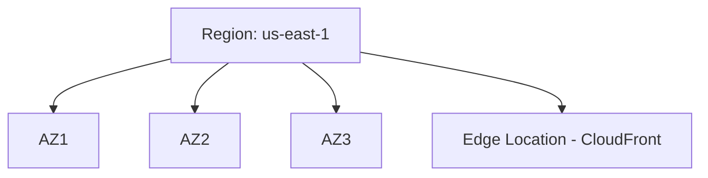
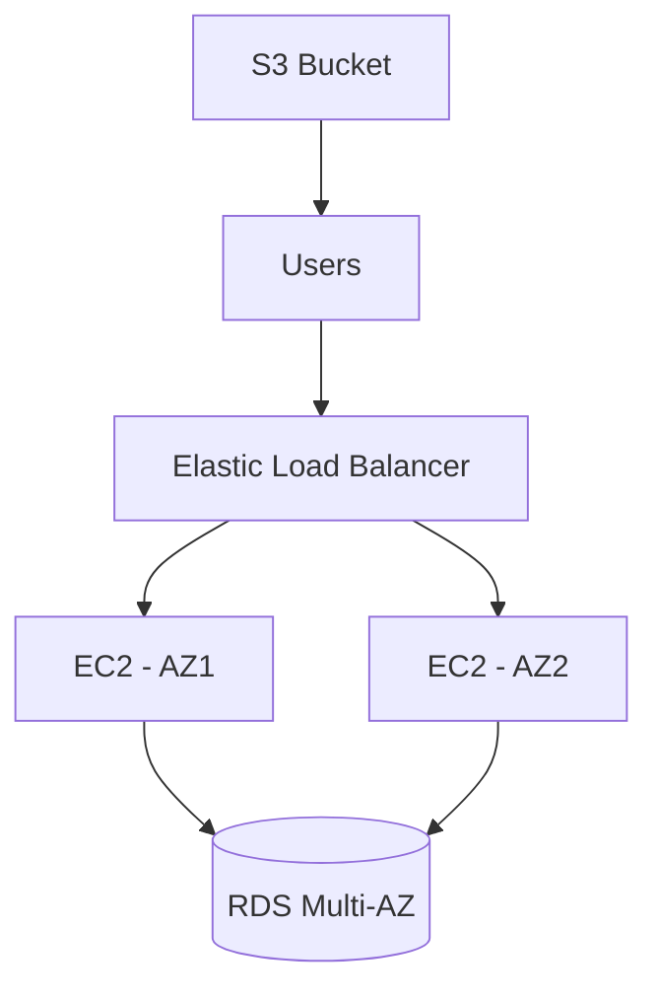

# AWS Fundamentals

## Q1: What is AWS and why is it widely used?
**Answer:**  
AWS (Amazon Web Services) is the world’s largest cloud services provider, offering on-demand compute, storage, networking, databases, machine learning, and more.  
- **Elastic & Scalable** – resources scale up/down instantly.  
- **Pay-as-you-go** – only pay for what you use.  
- **Global Infrastructure** – 30+ regions, 90+ Availability Zones.  
- **Secure** – shared responsibility model.  

---

## Q2: Explain the Shared Responsibility Model.
**Answer:**  
- **AWS responsibility** → Security **of** the cloud (infrastructure, physical security, managed services).  
- **Customer responsibility** → Security **in** the cloud (IAM, encryption, OS patching, application security).  

---

## Q3: Difference between Region, AZ, and Edge Location.
- **Region** → Geographical area (e.g., `us-east-1`).  
- **Availability Zone (AZ)** → Physically isolated datacenters within a region.  
- **Edge Location** → Used by CloudFront (CDN) for caching content closer to users.  

**Diagram (Mermaid):**


---

## Q4: Hands-on Example – Launch an EC2 instance (CLI)
```bash
aws ec2 run-instances   --image-id ami-12345678   --count 1   --instance-type t2.micro   --key-name my-key   --security-groups my-sg
```

---

## Q5: Scenario – You need high availability for a web app. How would you design it?
**Answer:**  
- Deploy EC2s across **multiple AZs** in an Auto Scaling group.  
- Use an **Elastic Load Balancer**.  
- Store static content in **S3**.  
- Use **RDS Multi-AZ** for database.  

**Diagram:**  

