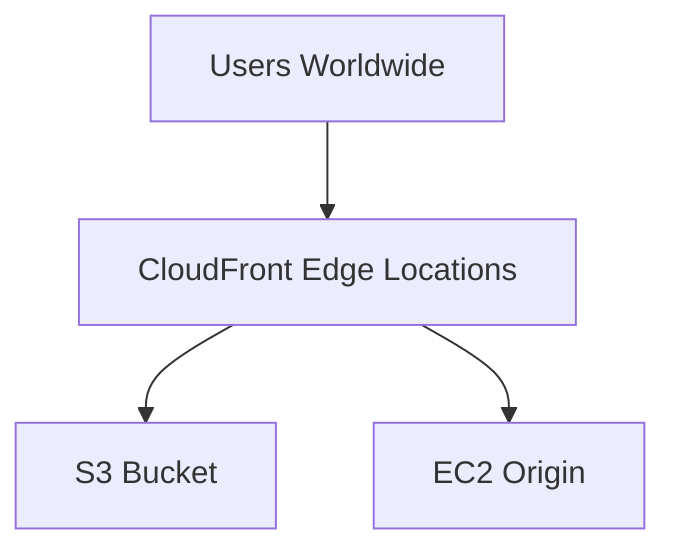

# Networking & CloudFront

## Q1: Explain VPC and its components.
- **VPC (Virtual Private Cloud)** → logically isolated network.  
- Components:  
  - **Subnets** (public/private).  
  - **Route Tables**.  
  - **Internet Gateway (IGW)** → external access.  
  - **NAT Gateway** → private subnet outbound access.  
  - **Security Groups** → stateful firewall.  
  - **NACLs** → stateless firewall.  

---

## Q2: Hands-on – Create a VPC (CLI)
```bash
aws ec2 create-vpc --cidr-block 10.0.0.0/16
aws ec2 create-subnet --vpc-id vpc-123456 --cidr-block 10.0.1.0/24
aws ec2 create-internet-gateway
aws ec2 attach-internet-gateway --vpc-id vpc-123456 --internet-gateway-id igw-123456
```

---

## Q3: Difference between Security Groups and NACLs.
- **Security Groups** → Stateful, applied at ENI/instance level.  
- **NACLs** → Stateless, applied at subnet level.  

---

## Q4: CloudFront Use Case.
- CDN (Content Delivery Network).  
- Caches content at **edge locations**.  
- Reduces latency, improves performance.  

**Diagram:**  


---

## Q5: Scenario – Host a static website with low latency for global users.
**Answer:**  
- Store website in **S3**.  
- Enable **Static Website Hosting**.  
- Distribute via **CloudFront**.  
- Use **Route53** for DNS.  
