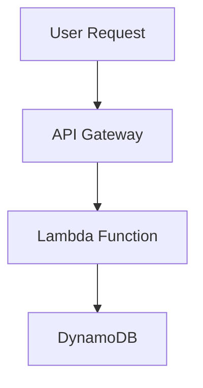

# Serverless & Lambda

## Q1: What is Serverless in AWS?
- Fully managed services where infrastructure is abstracted.  
- Pay only for execution time.  
- Examples: **Lambda, API Gateway, DynamoDB, S3, Step Functions**.  

---

## Q2: AWS Lambda Basics.
- **Event-driven** compute service.  
- Supports multiple runtimes (Node.js, Python, Java, etc.).  
- Max execution time: 15 minutes.  

**Example Lambda (Python):**
```python
def lambda_handler(event, context):
    name = event.get("name", "Guest")
    return {"message": f"Hello, {name}!"}
```

---

## Q3: Hands-on – Deploy Lambda with CLI.
```bash
aws lambda create-function   --function-name myLambda   --runtime python3.9   --role arn:aws:iam::123456789012:role/execution_role   --handler lambda_function.lambda_handler   --zip-file fileb://function.zip
```

---

## Q4: Step Functions Use Case.
- Orchestrates multiple Lambdas.  
- Example: ETL pipeline → S3 upload → Lambda parse → DynamoDB store → Notify via SNS.  

---

## Q5: Scenario – Build a REST API with Lambda.
**Answer:**  
- Use **API Gateway** + **Lambda**.  
- Lambda processes requests, API Gateway provides endpoints.  
- Store data in **DynamoDB**.  

**Diagram:**  

